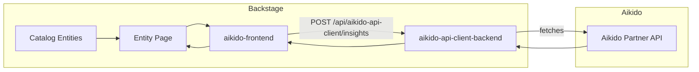

# Contributing

## Prerequisites

- Node.js 18 or later
- npm 9 or later (for workspace support)

## Setup

```bash
git clone https://github.com/AikidoSec/aikido-backstage-plugin.git
cd aikido-backstage-plugin
npm install --legacy-peer-deps
```

> `--legacy-peer-deps` is needed due to a peer dependency conflict between `express@^5` (used by the backend) and `express-promise-router@4` (which expects `express@^4`).

## Project Structure

```
aikido-backstage-plugin/
├── aikido-common/               # Shared types between backend and frontend
├── aikido-api-client-backend/   # Backstage backend plugin (Aikido API integration)
└── aikido-frontend/             # Backstage frontend plugin (UI components)
```

### Architecture



## Development Workflow

Each submodule can be developed in isolation using the Backstage CLI:

```bash
# Backend plugin
cd aikido-api-client-backend
npx backstage-cli package start

# Frontend plugin
cd aikido-frontend
npx backstage-cli package start
```

### Running Tests

```bash
cd aikido-api-client-backend && npx backstage-cli package test
cd aikido-frontend && npx backstage-cli package test
```

## Testing with Real Credentials

To test the backend plugin against a live Aikido API:

1. Copy the example config:

```bash
cp aikido-api-client-backend/dev/rootConfig.json.example \
   aikido-api-client-backend/dev/rootConfig.json
```

2. Fill in your credentials:

```json
{
  "data": {
    "catalog": {
      "providers": {
        "aikido": {
          "clientId": "your-client-id",
          "authSecret": "your-auth-secret"
        }
      }
    }
  }
}
```

`rootConfig.json` is gitignored — never commit credentials.

## Coding Conventions

- TypeScript throughout; no `any` unless unavoidable
- Shared types belong in `aikido-common/src/types.ts`
- Follow Backstage plugin architecture conventions (see [Backstage docs](https://backstage.io/docs/plugins/))
