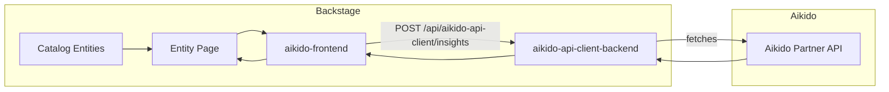
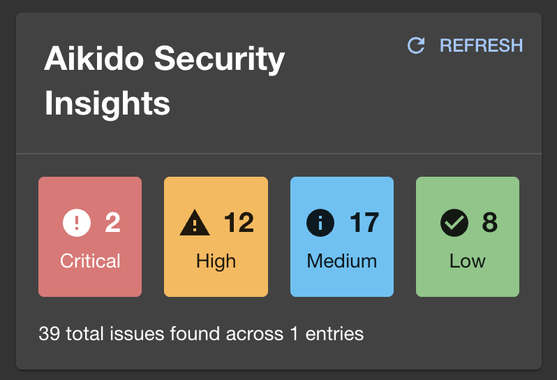
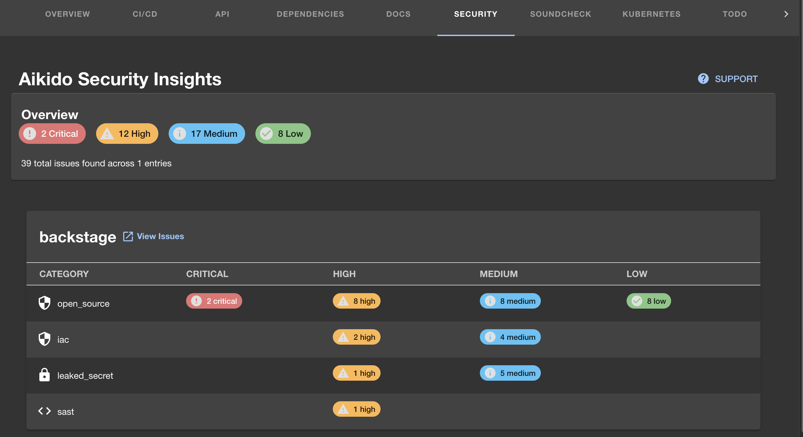

# Aikido Backstage Plugins

Backstage plugins that surface [Aikido](https://aikido.dev) security insights directly on your catalog entity pages.

## Features

- **Overview card** — aggregated vulnerability counts by severity (critical / high / medium / low) on any entity overview page
- **Security tab** — full per-repository, per-category breakdown as a dedicated entity tab
- **Conditional rendering** — components only appear when the entity has relevant SCM or Aikido annotations
- **Aikido Partner API integration** — fetches live data via the backend plugin; no frontend API keys needed

## Packages

| Package | Description |
|---------|-------------|
| [`aikido-frontend`](aikido-frontend/README.md) | Frontend plugin — entity card and tab components |
| [`aikido-api-client-backend`](aikido-api-client-backend/README.md) | Backend plugin — proxies requests to the Aikido Partner API |
| `aikido-common` | Shared TypeScript types (consumed internally) |

## Architecture



## Screenshots

### Overview card



### Entity tab



## Installation

### 1. Install packages

```bash
yarn add --cwd packages/app @internal/backstage-plugin-aikido-frontend
yarn add --cwd packages/backend @internal/backstage-plugin-aikido-api-client-backend
```

### 2. Enable the backend plugin

In `packages/backend/src/index.ts`:

```ts
const backend = createBackend();
// ...
backend.add(import('@internal/backstage-plugin-aikido-api-client-backend'));
```

### 3. Configure credentials

Obtain `clientId` and `authSecret` from the [Aikido Partner Portal](https://partners.aikido.dev/settings/api) and add them to `app-config.yaml`:

```yaml
catalog:
  providers:
    aikido:
      clientId: ${AIKIDO_CLIENT_ID}
      authSecret: ${AIKIDO_AUTH_SECRET}
```

### 4. Add UI components to the entity page

In `packages/app/src/components/catalog/EntityPage.tsx`:

```tsx
import {
  EntityAikidoInsightsCard,
  EntityAikidoInsightsContent,
  hasAikidoOrScmAnnotations,
} from '@internal/backstage-plugin-aikido-frontend';

// Overview card
<EntityAikidoInsightsCard />

// Security tab
<EntityLayout.Route if={hasAikidoOrScmAnnotations} path="/aikido" title="Security">
  <EntityAikidoInsightsContent />
</EntityLayout.Route>
```

### 5. Entity annotations

The plugins activate when one of the following annotations is present:

| Annotation | Source | Example |
|------------|--------|---------|
| `github.com/project-slug` | Added by Backstage automatically | `my-org/my-repo` |
| `gitlab.com/project-slug` | Added by Backstage automatically | `my-group/my-repo` |
| `aikido.dev/repo-ids` | Add manually | `123, 456` |
| `aikido.dev/workspace-ids` | Add manually | `789` |

## Contributing

See [CONTRIBUTING.md](CONTRIBUTING.md).

## License

See [LICENSE](LICENSE).
