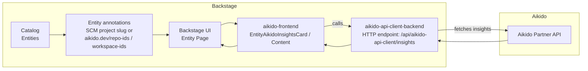

# Aikido Backstage Plugins

This repository contains Backstage plugins that integrate Aikido security insights into Backstage.

## Disclaimer

This project is not affiliated with, endorsed by, or sponsored by Backstage, Spotify AB, or Aikido Security BV.

## Packages

- **`aikido-frontend`** (`@internal/backstage-plugin-aikido-frontend`)
  - Frontend plugin that adds an entity overview card and an entity tab that display Aikido security insights.
  - See `aikido-frontend/README.md`.

- **`aikido-api-client-backend`** (`@internal/backstage-plugin-aikido-api-client-backend`)
  - Backend plugin that exposes an endpoint used by the frontend plugin to retrieve insights from the Aikido Partner API.
  - See `aikido-api-client-backend/README.md`.

- **`aikido-common`** (`@internal/backstage-plugin-aikido-common`)
  - Shared types/utilities used by both frontend and backend packages.
  - See `aikido-common/README.md`.

## Architecture



## Screenshots

### Overview card


### Entity tab


## Using the plugins in a Backstage app

### 1) Install packages

Install the frontend plugin into your Backstage app package:

```bash
yarn add --cwd packages/app @internal/backstage-plugin-aikido-frontend
```

Install the backend plugin into your Backstage backend package:

```bash
yarn add --cwd packages/backend @internal/backstage-plugin-aikido-api-client-backend
```

### 2) Enable the backend plugin

Add the backend plugin to your backend in `packages/backend/src/index.ts`:

```ts
const backend = createBackend();
// ...
backend.add(import('@internal/backstage-plugin-aikido-api-client-backend'));
```

### 3) Configure credentials

Configure [Aikido credentials from the Partner Portal](https://partners.aikido.dev/settings/api) in `app-config.yaml` (prefer env vars for secrets):

```yaml
catalog:
  providers:
    aikido:
      clientId: ${AIKIDO_CLIENT_ID}
      authSecret: ${AIKIDO_AUTH_SECRET}
```

### 4) Add UI components to the entity page

Add the Aikido components to your entity pages (example: `packages/app/src/components/catalog/EntityPage.tsx`):

```tsx
import {
  EntityAikidoInsightsCard,
  EntityAikidoInsightsContent,
  hasAikidoOrScmAnnotations,
} from '@internal/backstage-plugin-aikido-frontend';

// Add the card to the overview
// <EntityAikidoInsightsCard />

// Add the tab
// <EntityLayout.Route if={hasAikidoOrScmAnnotations} path="/aikido" title="Security">
//   <EntityAikidoInsightsContent />
// </EntityLayout.Route>
```

### 5) Entity annotations

The frontend renders when one of the following is present:

- SCM annotations automatically provided by Backstage (for example `github.com/project-slug`)
- Aikido annotations:
  - `aikido.dev/repo-ids`
  - `aikido.dev/workspace-ids`

## Development

This repo is a set of Backstage packages. Typical workflows:

- Build:

```bash
yarn build
```

- Lint:

```bash
yarn lint
```

- Test:

```bash
yarn test
```

For plugin-specific development instructions, see each package README.

## License

See [`LICENSE`](LICENSE).
